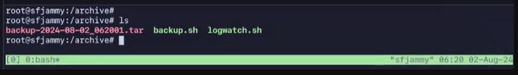

# Module OS 3: Administrating GNU Linux

## Task 1: install
Напишите Bash-скрипт, который автоматически настраивает систему под вас. В дальнейшем вы сможете его использовать на новых виртуальных машинах с ОС Linux.

УСЛОВИЯ РЕАЛИЗАЦИИ
Что должно быть в скрипте:

Проверка на наличие репозитория Backports в списке репозиториев. Если отсутствует — добавляем (под используемый вами дистрибутив).
Обновление пакетного менеджера.
Установка и запуск Apache2.
Установка Python.
Установка и поднятие SSH-сервера.
Cкрипт должен содержать минимум 10 действий, включая указанные выше. К 5 обязательным действиям добавьте ещё 5 на ваше усмотрение.

## Task 2: backup
Задание состоит из трёх этапов:

Напишите Bash-скрипт для резервного копирования директории /home, конфигурационных файлов основных утилит удалённого доступа (SSH, RDP, FTP), а также директории /var/log.
В cron создайте задачу для запуска этого скрипта каждую пятницу в 18:30.
Переместите получившийся бэкап в отдельную заранее созданную директорию /archive. 
УСЛОВИЯ РЕАЛИЗАЦИИ
В качестве ответа предоставьте:

Bash-скрипт.
Содержание файла crontab (текст) с созданной задачей.
Скриншот сделанного бэкапа.
Файлы загрузите на GitHub в отдельную от предыдущего пункта папку.

## Task 3: log

Настройте автоматическую отправку по почте логов изученных сервисов: SSH, FTP, RDP. 

УСЛОВИЯ РЕАЛИЗАЦИИ
Используйте утилиту Logwatch и планировщик задач cron. 
Письмо должно отправляться каждый день в 8:00. 
Уровень детализации — на ваше усмотрение.
В качестве ответа приложите:

Текст задачи в cron.
Команду для утилиты Logwatch (в отдельном текстовом файле).
Скриншот полученного письма.
Файлы загрузите на GitHub в отдельную от предыдущих пунктов папку.

